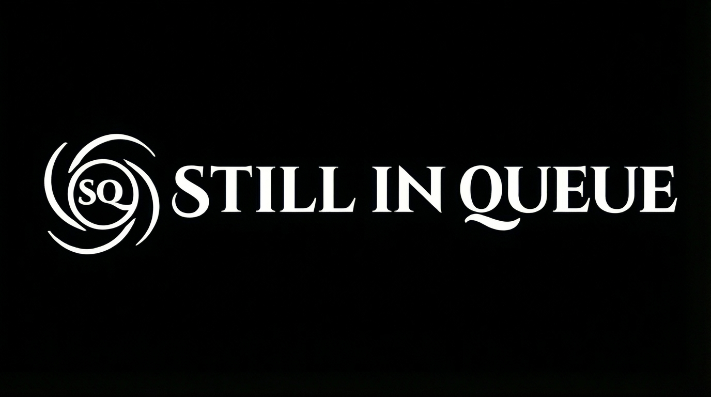
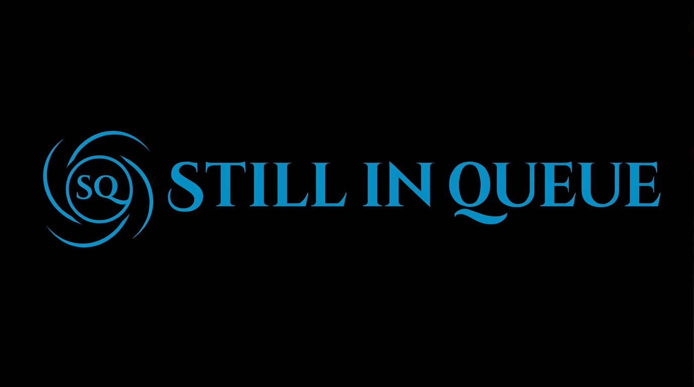
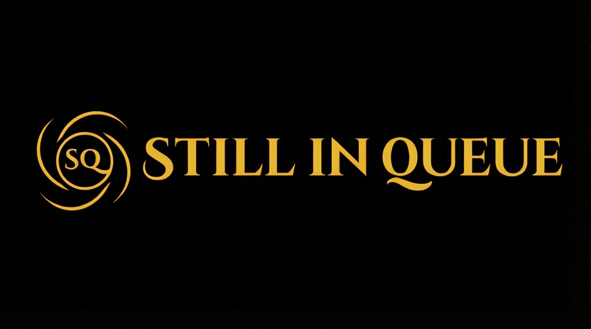
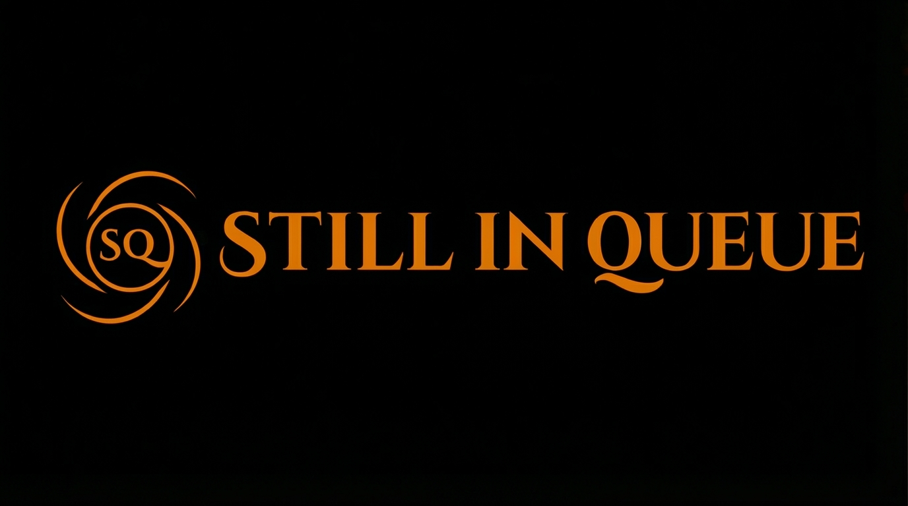
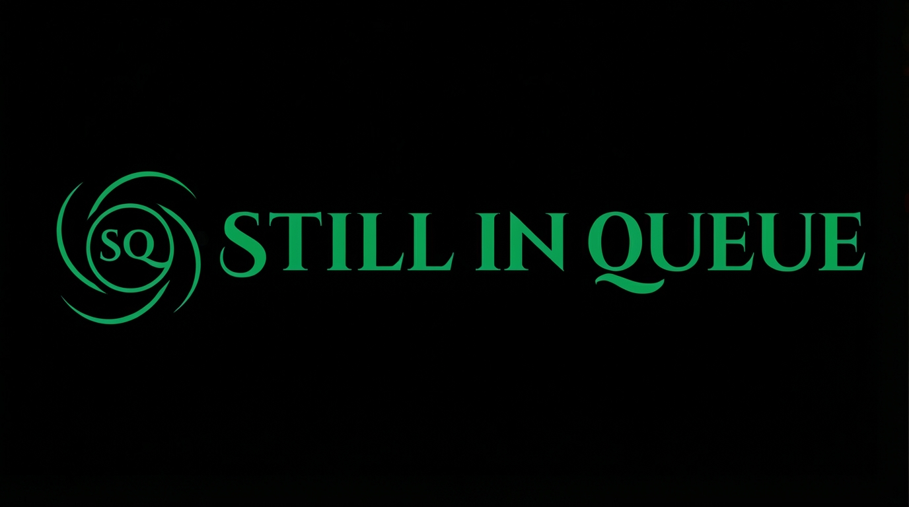

# Still In Queue

> **“A multi-domain AI assistant hub built for everyday productivity.”**



Still In Queue is a young startup aiming to bring **AI-powered help** into everyday life and work — not just in software, but across learning, local services, and even physical spaces.

The vision: **digitalizing (AI-first) every field** by providing domain-aware agents that can answer questions well, advise better, and proactively alert people based on their preferences.

**Live site:** https://stillinqueue.com  
**Status:** Early-stage, concept + static prototype (Phase 1)

---

## Folds (Products) under Still In Queue

This repo holds the static website and concept blueprints for multiple “folds” of Still In Queue.

### 🧠 SQ-AI — Agents



**SQ-AI** is the AI agents fold.

- Ready-to-use agents for common domains (productivity, travel, career, etc.).
- Long-term goal: a **visual agent builder** where users can create their own workflows via drag-and-drop (similar in spirit to node-based tools, but focused on AI agents and domain knowledge).
- Agents should be able to:
  - answer questions with context,
  - call tools / APIs,
  - notify users based on rules and preferences.

---

### 📚 SQ-LP — Learning Platform



**SQ-LP** is the learning fold.

A platform that combines:

- **E-Learning** for school & university support (maths, science, languages, exams).
- **Career & tech skills** (data, dev, design, business, communication).
- **Everyday learning** (finance, productivity, mindset, hobbies).
- **Sports & arts**: maps of academies, clubs, events for:
  - sports training,
  - dance, music, painting, pottery, photography,
  - spirituality, health, and wellness.

The idea: one place where **AI mentors** support structured content, and also connect learners to **real-world clubs and studios**.

---

### ☕ SQ-CC — Coffee & Creme



**SQ-CC (Coffee & Creme)** is the physical / experiential fold.

- Concept: an ice-cream + coffee space that doubles as:
  - a casual workspace,
  - a meetup spot,
  - a “healthy getaway” for people and teams.
- Long term:
  - in-store AI kiosks,
  - QR-based menus linked to SQ-AI agents,
  - offline events for creators, learners, and founders.

---

### ☀️ SQ-GE — Green Energy



**SQ-GE** is the green energy fold, starting with solar.

- Helps users **compare** world-class solar panels and equipment.
- Explains **investment, subsidies, breakeven, and long-term returns**.
- Supports:
  - residential rooftops,
  - shops & offices,
  - larger farm / field installations,
  - future expansion into other green energy sources.

---

## Phase Roadmap

The project is intentionally split into **phases**, so it can grow without becoming overwhelming.

### Phase 1 — Concept & Static Site ✅ (in progress)

- Static multi-page site (HTML/CSS/JS) hosted on **GitHub Pages**.
- High-level explanation of each fold.
- Visual branding, logos, and navigation.
- Simple waitlist / contact flow (email-based for now).

### Phase 2 — Interactive Tools & Prototypes

- Add **browser-only tools**:
  - basic calculators (e.g. SQ-GE solar breakeven).
  - simple forms for leads / waitlists.
- Embed small **AI demos** using public APIs (where allowed).
- Start capturing **structured user interest** (which fold, what use case, etc.).

### Phase 3 — Real Backend & Accounts

- Backend (Python + FastAPI) with:
  - user accounts,
  - basic auth / sessions,
  - saved preferences and scenarios.
- Database (PostgreSQL) for:
  - user profiles,
  - leads,
  - experiment results (e.g. calculator runs).
- Integrations:
  - email / notification service,
  - potential solar product feeds, learning content sources, etc.

### Phase 4 — Automation, Marketplace & Integrations

- Agent marketplace under **SQ-AI** (shareable / installable agents).
- Tools to connect agents with:
  - calendars, emails, CRMs, or simple APIs.
- Scaling SQ-GE into:
  - lead management + installer network,
  - dashboards for larger solar/green projects.
- Community & events integrations with **SQ-LP** and **SQ-CC**.

---

## Target Audience

This project is meant for:

- **Students and lifelong learners**  
  who want AI-guided help for school, university, careers, and hobbies.

- **Knowledge workers & small teams**  
  who want multi-domain AI agents to offload planning, writing, and research.

- **Homeowners & business owners**  
  who are curious about solar and other green energy investments.

- **Local communities & creators**  
  who might use SQ-CC and SQ-LP as both physical and digital spaces to meet, learn, and collaborate.

---

## 6-Month Goals (Draft)

These are realistic goals for the next ~6 months of work:

1. **Stabilize the static site**
   - All core folds described.
   - Clean navigation, mobile-friendly.

2. **Launch at least 3 prototype agents (SQ-AI)**
   - 1 productivity / planning agent.
   - 1 learning support agent.
   - 1 solar advisory / calculator helper.

3. **Build and ship the first SQ-GE calculator MVP**
   - User inputs: location, roof size, budget, usage pattern.
   - Outputs: simple capex, payback period, and breakeven estimate.

4. **Collect early users**
   - At least **100 waitlist signups** / email subscribers.
   - Talk to some of them to refine features.

5. **Backend v0**
   - Basic FastAPI service deployed,
   - simple endpoint to receive waitlist / calculator submissions,
   - store them in PostgreSQL.

---

## Tech Stack (Planned)

**Right now (Phase 1):**

- Frontend: Plain **HTML, CSS, vanilla JS**  
- Hosting: **GitHub Pages** + **Cloudflare** (DNS / proxy)

**Planned (Phase 2–3):**

- Backend: **Python + FastAPI**
- Database: **PostgreSQL**
- Hosting options (TBD): Render / Fly.io / Cloudflare Pages + Workers / similar.
- Auth: simple email-based login to start.
- Integrations: email provider, relevant APIs per fold.

---

## Repository Structure (planned)

(This may change as the project grows.)

```text
/
├── index.html          # Main landing page
├── ai.html             # SQ-AI concept page (planned)
├── learning.html       # SQ-LP concept page
├── green.html          # SQ-GE concept page
├── cc.html             # SQ-CC concept page
├── assets/             # Images, logos, icons
│   ├── Fav-Photoroom.png
│   ├── SQ-Group.jpeg
│   ├── SQ-AI.jpeg
│   ├── SQ-EL.jpeg
│   ├── SQ-GE.jpeg
│   └── SQ-IC.jpeg
├── css/                # (optional) extracted styles
└── README.md
